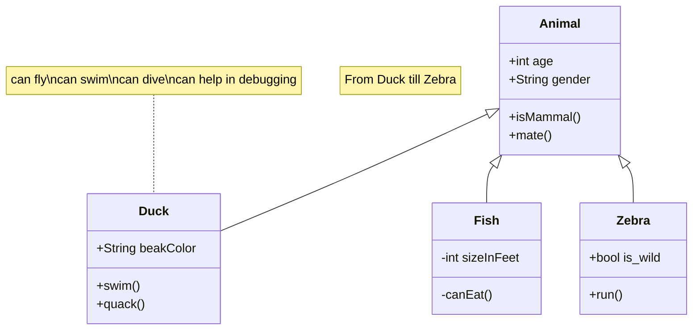

### Git ve GitHub Eğitimi

> Eğitimi özellikle "zamanda yolculuk" ve "çoklu evrenler teorisi" üzerine analojiler kurarak anlatmaya çalışacağım.

> Gösterimleri de mermaid ile yapacağım.

### Kullanacağım Araçlar

- [VsCode](https://code.visualstudio.com/)

  - [Git History](https://marketplace.visualstudio.com/items?itemName=donjayamanne.githistory)
    - [Git Graph](https://marketplace.visualstudio.com/items?itemName=mhutchie.git-graph)
  - [Markdown Preview Enhanced](https://marketplace.visualstudio.com/items?itemName=shd101wyy.markdown-preview-enhanced)
  - [Mermaid Markdown Syntax Highlighting](https://marketplace.visualstudio.com/items?itemName=bpruitt-goddard.mermaid-markdown-syntax-highlighting)
  - [Git Lens — Git supercharged](https://marketplace.visualstudio.com/items?itemName=eamodio.gitlens)
  - [GitHub Copilot](https://marketplace.visualstudio.com/items?itemName=GitHub.copilot)
  - [gitignore](https://marketplace.visualstudio.com/items?itemName=codezombiech.gitignore)

- [Git](https://git-scm.com/)
- [GitHub](https://github.com)
- [Mermaid](https://mermaid-js.github.io/mermaid/#/)
- [Markdown](https://www.markdownguide.org/basic-syntax/)

---

## title: Animal example

